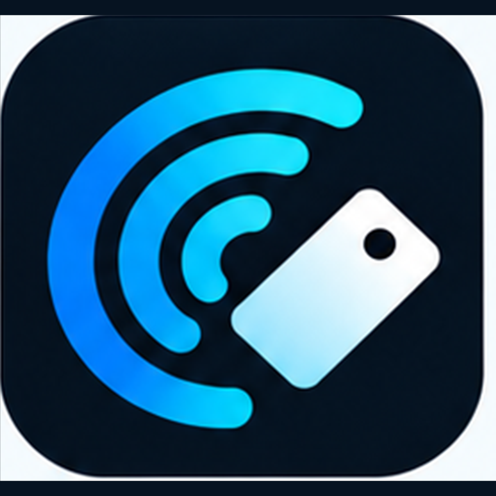

<p align="center">
  
</p>

# NFCove

**Read. Build. Automate.**

NFCove is a native NFC utility for iPhone focused on a reliable NDEF workflow: read, inspect, save, create, write, and verify compatible NFC tags.

> Documentation: **English** · [Español](README.es.md)

> **Current development version:** 0.4.0 (build 8). Tagged releases are produced from the same tested IPA pipeline used by CI.

## Current foundation

- Native SwiftUI interface
- Core NFC NDEF reader using the current `TAG` NFC entitlement
- NDEF writer for Text, URL, Email, Phone, SMS, and Location records
- Human-readable payload parser
- Scan results can be saved as reusable library entries with the original NDEF TNF, type, identifier, payload, and record order when available
- Local library stored atomically in Application Support, with migration from the earlier preferences-backed format
- Saved scans and created cards can be reopened and written back to a compatible tag, with read-back verification
- URL, email, phone, SMS, and location content is normalized and validated before an NDEF message is created
- Post-write read-back verification for compatible NDEF tags
- Portable core tests run in CI for normalization, persistence, migration, and corrupt-store preservation
- English, Spanish, and System Language modes
- No third-party runtime dependencies

## Requirements

- Xcode 26 or newer for App Store/TestFlight release builds
- iOS 18 or newer
- A physical NFC-capable iPhone for NFC operations
- An Apple Developer signing setup with the **Near Field Communication Tag Reading** capability enabled

Core NFC sessions do not run in the iOS Simulator.

## Run

1. Clone the repository.
2. Open `NFCove.xcodeproj` in Xcode.
3. Select the `NFCove` target.
4. Choose your development team under **Signing & Capabilities**.
5. Ensure the NFC capability is available for the selected App ID.
6. Build and run on a physical iPhone.

## Project structure

```text
NFCove/
├── App/            App entry point, navigation, language and shared stores
├── Core/NFC/       Core NFC session and NDEF encoding logic
├── Features/       Home, Scan, Create, Library and Settings
├── Models/         Shared app and NFC models
└── Resources/      Info.plist, entitlements and localization
```

See [docs/en/architecture.md](docs/en/architecture.md) for architecture, [docs/en/ipa.md](docs/en/ipa.md) for IPA builds and signing, [docs/en/testing.md](docs/en/testing.md) for the physical-device release gate, [docs/en/testflight.md](docs/en/testflight.md) for TestFlight preflight, and [docs/en/app-store.md](docs/en/app-store.md) for App Store submission.

## Product direction

NFCove is intentionally not a visual clone of existing NFC utilities. The goal is to make common NFC workflows feel like a first-class Apple platform experience: clear scan results, reliable local storage, transparent compatibility feedback, and verified writing.

## Privacy

NFC reads and writes happen locally through Apple's Core NFC framework. The current foundation does not require an account and does not send NFC contents to a server.

## Status

Release hardening for 0.4.0. CI targets macOS 26 / Xcode 26+, while final NFC acceptance still requires a physical NFC-capable iPhone. Public privacy/support URLs, screenshots, and App Store Connect metadata are external release-gate items.

## Contact, support, and feedback

Have a **question**, **suggestion**, found a **bug**, or want to share **feedback** about NFCove? Use the project's GitHub Issues form:

**[Open the contact and feedback form](https://github.com/tiburonns/NFCove/issues/new?template=feedback.yml)**

Choose the category that best fits: **Question, Suggestion, Bug, Feedback, Compatibility, or Other**. Include the app version, device/OS, and reproduction steps when relevant.

Do not post passwords, tokens, keys, private addresses, or other sensitive personal information. For security vulnerabilities, follow the process in `SECURITY.md` when available.

